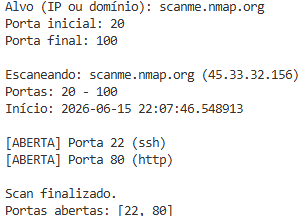

# 🔎 Port Scanner em Python

<p align="center">
  
  
  
  
  
  
  
</p>

---

## 🚀 Sobre o Projeto

Este é um scanner de portas simples desenvolvido em Python como parte da minha jornada de aprendizado em **Cibersegurança**.

A ferramenta permite identificar portas abertas em um determinado alvo (IP ou domínio), ajudando a compreender melhor como serviços de rede funcionam.

---

## 🧠 O que eu aprendi

* Fundamentos de redes (TCP/IP)
* Funcionamento de portas e serviços
* Programação com sockets em Python
* Lógica de varredura de rede
* Tratamento de erros

---

## 🛠️ Funcionalidades

* Varredura de intervalo de portas
* Identificação de portas abertas
* Detecção de serviços (HTTP, SSH, etc.)
* Conversão de domínio para IP

---

## ▶️ Como usar

Execute o script:

```bash
python scanner.py
```

Depois, informe:

* Alvo (IP ou domínio)
* Porta inicial
* Porta final

---

## 💻 Exemplo real de execução

```text
Alvo (IP ou domínio): scanme.nmap.org
Porta inicial: 20
Porta final: 100

Escaneando: scanme.nmap.org (45.33.32.156)
Portas: 20 - 100
Início: 2026-06-15 22:07:46.548913

[ABERTA] Porta 22 (ssh)
[ABERTA] Porta 80 (http)

Scan finalizado.
Portas abertas: [22, 80]
```

---

## 📸 Exemplo visual

<p align="center">
  
</p>

---

## ⚠️ Aviso Importante

Este projeto é apenas para **fins educacionais**.

Utilize esta ferramenta somente em sistemas que você possui ou tem autorização para testar.

---

## 📚 Nota de Aprendizado

Este projeto foi desenvolvido como parte dos meus estudos em cibersegurança.

Foi construído com o apoio de **IA como ferramenta de aprendizado**, e todo o código foi estudado, compreendido e adaptado por mim durante o processo.

---

## 🚀 Próximas melhorias

* Implementar multithreading (melhorar performance)
* Salvar resultados em arquivo
* Melhorar interface do usuário
* Adicionar funcionalidades de análise mais avançadas

---

## 🎯 Objetivo

Desenvolver habilidades práticas em segurança da informação e construir um portfólio sólido para atuar na área de **Cybersecurity**.

---

## 👨‍💻 Autor

<p align="center">
  <a href="https://github.com/daniell-sec">
    
  </a>
</p>

<h3 align="center">Daniel Alves</h3>

<p align="center">
🔐 Cybersecurity Student <br>
🐍 Python | 🌐 Networking | ☁️ Cloud | 🛡️ Security
</p>